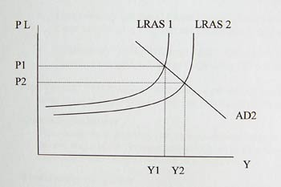

Macroeconomics A2

*Economic growth in developing/emerging markets*

The things that cause positive growth:

-   Urbanization process continues

-   Industrialisation

-   Population growth (demographic dividend)

-   Per-capita income growth

-   Focus on supply-side reforms to drive more competition and productivity

-   Improved human capital to absorb existing new technologies developing
    countries

-   Technological innovation in many emerging markets (especially in South
    Korea, China, India)

A shift in AD will lead to an increase in income, output and expenditure. The
trade-off is the price level. As it increases, eventually, it has a negative
impact. As it gets closer to LRAS, inflation can cause a lack of consumption.
BoP will worsen as imports are cheaper due of the price of UK goods.

*Differences between long and short run growth*

| Short Term Economic Growth   | Long Run Economic Growths        |
|------------------------------|----------------------------------|
| Cyclical Changes in real GDP | Potential output/trend growth    |
| Changes in AD                | Production of labour and capital |
| Short term external shocks   | Changes in the labour force      |
| Short term policy changes    | Investment rates                 |

*Key factors affecting long run economic growth*

-   Investment

-   Productivity

-   Labour Supply

-   Research

-   Innovation

-   Enterprise

Problems:

-   Savings gap

-   Small scale financial institutes don’t invest enough

-   Deep weakness in human capital

-   Risks from unbalanced growth

-   Investment in natural resources depletion

-   Risks of borrowing to plug savings gap

*What are the main benefits of Economic Growth?*

-   Higher living standards – real GNI per capita – helps lift people out of
    poverty

-   Employment effects – sustained growth stimulates jobs and contributes to
    lower unemployment rates with helps to reduce income inequality.

-   Fiscal divide – Higher economic growth will raise tax revenues and reduce
    government spending on unemployment and poverty related welfare benefits

-   Accelerator effect – rising growth stimulates new investment e.g. in low
    carbon technology. Better growth may attract foreign investment projects.

Economic and social costs of growth

-   Risks of higher inflation – cost push and demand pull

    -   Increase interest rates which is BAD

-   Environmental effects – More negative externalities. Morrel hazard

-   Inequalities of income and wealth.

    -   Rapid increases in real national income are rarely distributed.

Standards of living

It is measured by taking household income, taking away tax, adding benefits. It
I then inflation adjusted.

Even though standards of living are back to where they were before the crash, if
we break this down into age groups, the over 60 group is much higher, 31-59 are
pretty much the same but the lower age groups is falling.

Looking at inequality – since the 80s, it has got worse. There was a spike when
the UK assets were sold off by the witch.
